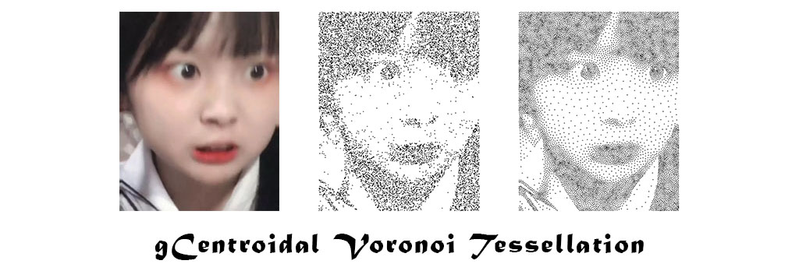

  

We propose a novel algorithm to compute centroidal Voronoi tessellation using the GPU. It is based on the iterative approach of Lloyd’s method while having good considerations to address the two major challenges of achieving fast convergence with few iterations, and at the same time achieving fast computation within each iteration. Our implementation of the algorithm can complete the computation for a large image in the order of hundreds of milliseconds and is faster than all prior work on a state-of-the-art GPU. As such, it is now easier to integrate centroidal Voronoi tessellations into interactive applications.

**Keywords:** GPGPU, Computational Geometry, Digital Geometry, Lloyd's Method, Voronoi Diagram, PBA

**Website:** [https://www.comp.nus.edu.sg/~tants/cvt.html](https://www.comp.nus.edu.sg/~tants/cvt.html)
